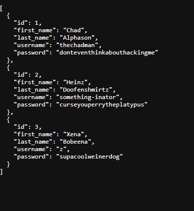

# Inventory Management Application

### About This App

This is an application designed to help those in need of visual and digital organization. Whether you're an individual who frequently loses track of items or an inventory manager who needs to keep tabs on the items you're in charge of, this app meets all those needs. As an unauthenticated visitor, you can view all the items in the database created by users. As an authenticated user, you can add new items to your inventory and track them on a dashboard. You are also able to edit and delete items from your inventory as you please!

## Run Locally On Your Machine

### If Your're Using Your Own Database Ensure The Naming Convention is Like The Following:




### Initial Requirements

Ensure you have the following installed:

-   [Node.js](https://nodejs.org/)
-   npm (comes with Node.js)
-   Git (to clone the repository)
-   [Docker](https://www.docker.com/)

### 1. Clone My Repo

```sh
  git clone https://github.com/ethandiem/Z-Prefix-Inventory-App.git
```

### 2. Navigate to the project directory

```sh
  cd Z-Prefix-Inventory-App
```
### 3. Create a File called .env and add the following:

```sh
CLIENT_PORT=
SERVER_PORT=
DATABASE_PORT=
USER_NAME=
USER_PASSWORD=
DATABASE_NAME=
```

Fill in the values to the right of the equal sign to your liking. Ensure that the port numbers in the first three values are integers between 0 and 655535. To keep it simple, I recommend using the default postgres credentials along with a database name of "database." Please ensure you have nothing else running on the ports you chose. All fields must be filled!

### 4. Run the following commands:

```sh
npm install --prefix ./server
```

```sh
npm install --prefix ./client
```

### 5. Spin Up The Application:

#### a. Start The Client Side First

```sh
npm run dev --prefix ./client
```

#### b. Start The Server Side Next

```sh
npm run dev --prefix ./server
```

#### c. Finally Start The Docker Database

```sh
docker compose up --build
```

## Issues You may Run In To

### Error

`The command 'docker' could not be found in this WSL 2 distro. We recommend to activate the WSL integration in Docker Desktop settings. For details about using Docker Desktop with WSL 2, visit: https://docs.docker.com/go/wsl2/`

`We recommend to activate the WSL integration in Docker Desktop settings. For details about using Docker Desktop with WSL 2, visit: https://docs.docker.com/go/wsl2/`

### Solution

This can occur if you use WSL and the solution is simply to open Docker Desktop and have it run in the background

### Error

You may have difficulty during the spin up process. Commonly the server does not start up properly.

### Solution

This is commonly due to a port being already occupied. You can try force killing that port and running the spin up command again.

#### On Windows Run The following:

replace <port_number> with the port numbers in your .env file.

```sh
lsof -i :<port_number>
```

If necessary use sudo:

```sh
sudo lsof -i :<port_number>
```

This will output a PID along with some other things, use the PID for the following command and replace <PID> with what it outputs:

```sh
kill -9 <PID>
```

If necessary use sudo:

```sh
sudo kill -9 <PID>
```

#### On Mac Run The Following:

```sh
sudo fuser -k <port_number>/tcp
```

## Author

[Ethan Diem](https://github.com/ethandiem)